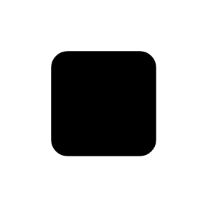

# Pin 

## Definition

```js
{
  _style: {
    entity: 'fontStyle=0;labelPosition=right;verticalLabelPosition=middle;align=left;verticalAlign=middle;spacingLeft=2;html=1;points=[[0,0.5],[1,0.5]];fillColor=strokeColor;',
  },
  _original_width: 30,
  _original_height: 30,

}
```

## Usage

```js
import { Pin } from '@dinghy/standard-components-diagrams/uml25'

<Pin/>
```

## Preview


