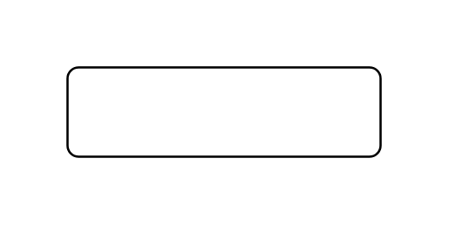

# State 3

## Definition

```js
{
  _style: {
    entity: 'html=1;align=center;verticalAlign=top;rounded=1;absoluteArcSize=1;arcSize=10;dashed=0;whiteSpace=wrap;',
  },
  _width: 140,
  _height: 40,
}
```

## Usage

```js
import { State3 } from '@dinghy/standard-components-diagrams/uml25'

<State3/>
```

## Preview


