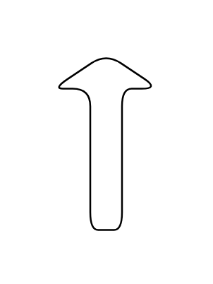
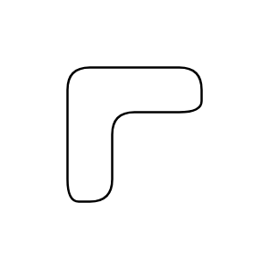
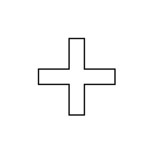
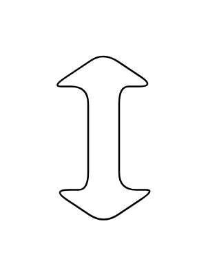
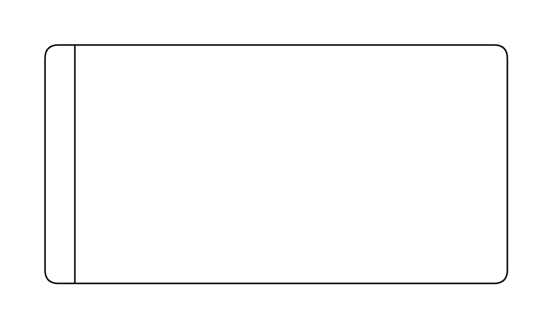
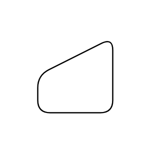
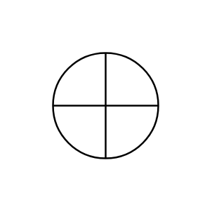
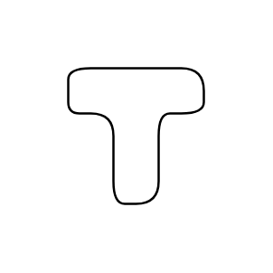
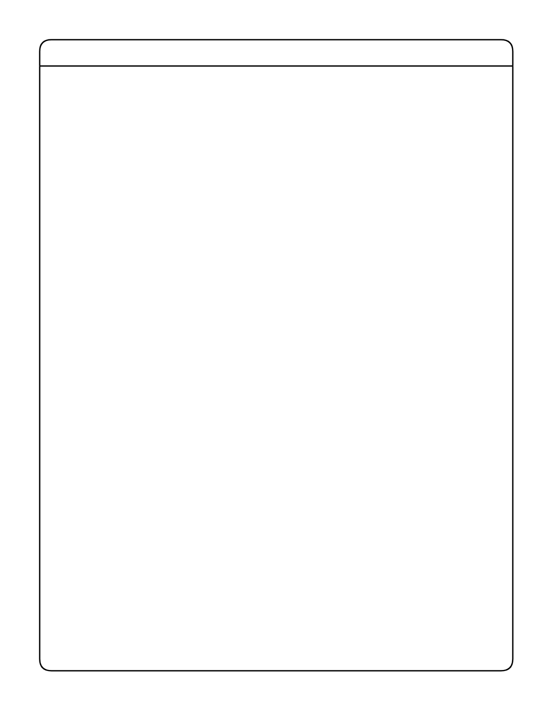
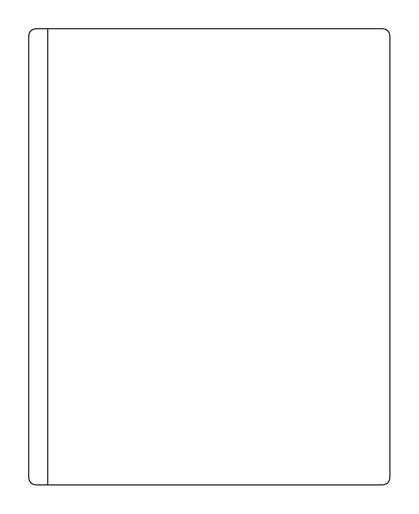

# Standard Advanced Entities

- [ArrowDown](./arrow-down.md)  

- [ArrowLeft](./arrow-left.md)  

- [ArrowRight](./arrow-right.md)  

- [ArrowUp](./arrow-up.md)  

- [Collate](./collate.md)  

- [Container](./container.md)  

- [Corner](./corner.md)  

- [Cross](./cross.md)  

- [DataStore](./data-store.md)  

- [Delay](./delay.md)  

- [Display](./display.md)  

- [DoubleArrow](./double-arrow.md)  

- [DoubleArrowVertical](./double-arrow-vertical.md)  

- [EllipseWithHorizontalDivider](./ellipse-with-horizontal-divider.md)  

- [EllipseWithVerticalDivider](./ellipse-with-vertical-divider.md)  

- [HorizontalFlowLayout](./horizontal-flow-layout.md)  

- [HorizontalPool1](./horizontal-pool-1.md)  

- [HorizontalPool2](./horizontal-pool-2.md)  

- [HorizontalTreeLayout](./horizontal-tree-layout.md)  

- [List](./list.md)  

- [ListItem](./list-item.md)  

- [LoopLimit](./loop-limit.md)  

- [ManualInput](./manual-input.md)  

- [OffPageConnector](./off-page-connector.md)  

- [Or](./or.md)  

- [ProcessBar](./process-bar.md)  

- [Sort](./sort.md)  

- [Sum](./sum.md)  

- [Switch](./switch.md)  

- [TapeData](./tape-data.md)  

- [Tee](./tee.md)  

- [User](./user.md)  

- [VerticalFlowLayout](./vertical-flow-layout.md)  

- [VerticalPool1](./vertical-pool-1.md)  

- [VerticalPool2](./vertical-pool-2.md)  

- [VerticalTreeLayout](./vertical-tree-layout.md)  

