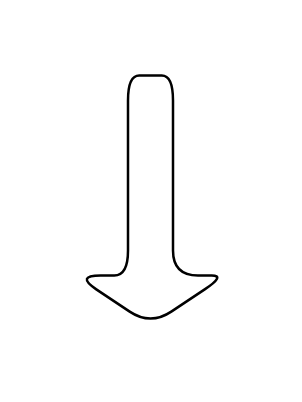

# Arrow Down

## Definition

```js
{
  _style: {
    entity: 'shape=singleArrow;direction=south;whiteSpace=wrap;html=1;',
  },
  _width: 60,
  _height: 100,
}
```

## Usage

```js
import { ArrowDown } from '@dinghy/standard-components-diagrams/advanced'

<ArrowDown/>
```

## Preview


