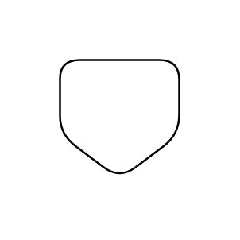

# Off Page Connector

## Definition

```js
{
  _style: {
    entity: 'shape=offPageConnector;whiteSpace=wrap;html=1;',
  },
  _original_width: 80,
  _original_height: 80,

}
```

## Usage

```js
import { OffPageConnector } from '@dinghy/standard-components-diagrams/advanced'

<OffPageConnector/>
```

## Preview


