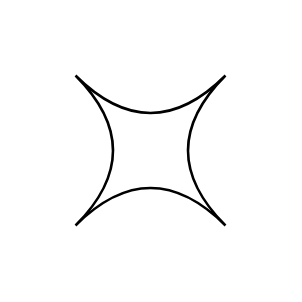

# Switch

## Definition

```js
{
  _style: {
    entity: 'shape=switch;whiteSpace=wrap;html=1;',
  },
  _original_width: 60,
  _original_height: 60,

}
```

## Usage

```js
import { Switch } from '@dinghy/standard-components-diagrams/advanced'

<Switch/>
```

## Preview


