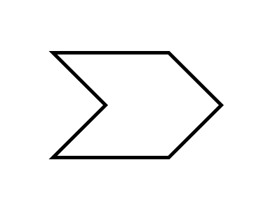

# Chevron Arrow

## Definition

```js
{
  _style: {
    entity: 'shape=mxgraph.arrows.chevron_arrow;html=1;verticalLabelPosition=bottom;verticalAlign=top;strokeWidth=2;strokeColor=#000000;',
  },
  _width: 96,
  _height: 60,
}
```

## Usage

```js
import { ChevronArrow } from '@dinghy/standard-components-diagrams/arrows'

<ChevronArrow/>
```

## Preview


