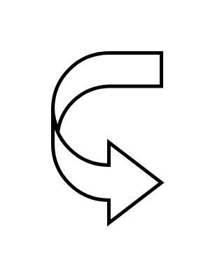

# U Turn Right Arrow

## Definition

```js
{
  _style: {
    entity: 'shape=mxgraph.arrows.u_turn_right_arrow;html=1;verticalLabelPosition=bottom;verticalAlign=top;strokeWidth=2;strokeColor=#000000;',
  },
  _width: 62,
  _height: 97,
}
```

## Usage

```js
import { UTurnRightArrow } from '@dinghy/standard-components-diagrams/arrows'

<UTurnRightArrow/>
```

## Preview


