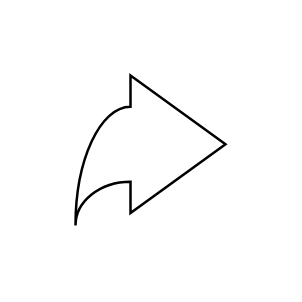

# Jump-In Arrow

## Definition

```js
{
  _style: {
    entity: 'html=1;shadow=0;dashed=0;align=center;verticalAlign=middle;shape=mxgraph.arrows2.jumpInArrow;dy=15;dx=38;arrowHead=55;',
  },
  _original_width: 100,
  _original_height: 100,

}
```

## Usage

```js
import { JumpInArrow } from '@dinghy/standard-components-diagrams/arrows2'

<JumpInArrow/>
```

## Preview


