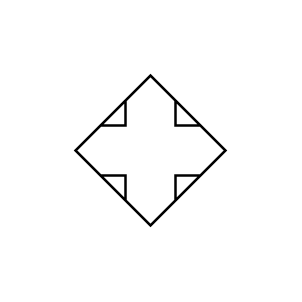

# Quad Arrow

## Definition

```js
{
  _style: {
    entity: 'html=1;shadow=0;dashed=0;align=center;verticalAlign=middle;shape=mxgraph.arrows2.quadArrow;dy=10;dx=20;notch=24;arrowHead=10;',
  },
  _original_width: 100,
  _original_height: 100,

}
```

## Usage

```js
import { QuadArrow } from '@dinghy/standard-components-diagrams/arrows2'

<QuadArrow/>
```

## Preview


