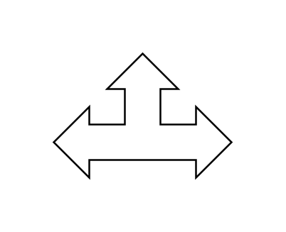

# Triad Arrow

## Definition

```js
{
  _style: {
    entity: 'html=1;shadow=0;dashed=0;align=center;verticalAlign=middle;shape=mxgraph.arrows2.triadArrow;dy=10;dx=20;arrowHead=40;',
  },
  _width: 100,
  _height: 70,
}
```

## Usage

```js
import { TriadArrow } from '@dinghy/standard-components-diagrams/arrows2'

<TriadArrow/>
```

## Preview


