# Standard Basic Entities

- [Component4PointStar](./component-4-point-star.md)  
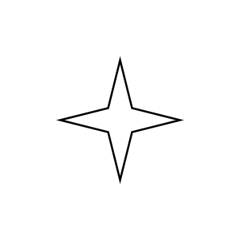

- [Component6PointStar](./component-6-point-star.md)  
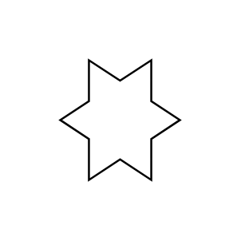

- [Component8PointStar](./component-8-point-star.md)  
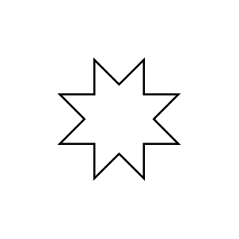

- [AcuteTriangle](./acute-triangle.md)  
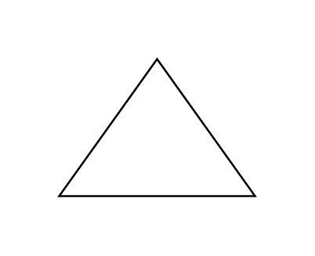

- [Arc](./arc.md)  
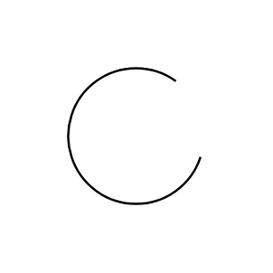

- [Banner](./banner.md)  
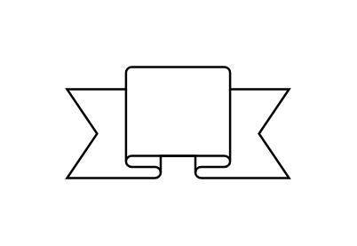

- [Button](./button.md)  
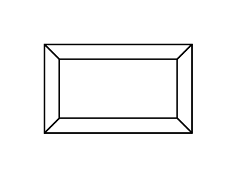

- [ButtonShaded](./button-shaded.md)  

- [CloudCallout](./cloud-callout.md)  

- [CloudRectangle](./cloud-rectangle.md)  
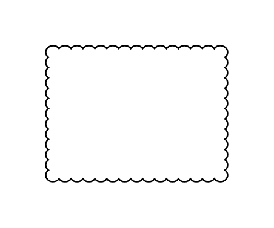

- [Cone](./cone.md)  
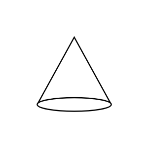

- [ConeAdjustable](./cone-adjustable.md)  
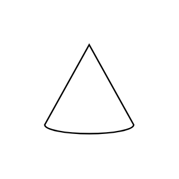

- [CornerRoundedRectangle](./corner-rounded-rectangle.md)  
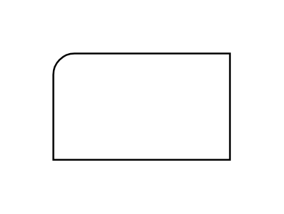

- [CylinderStack](./cylinder-stack.md)  
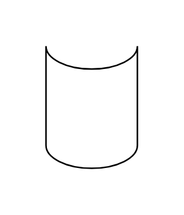

- [DiagonalRoundedRectangle](./diagonal-rounded-rectangle.md)  
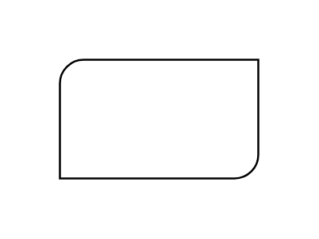

- [DiagonalSnipRectangle](./diagonal-snip-rectangle.md)  
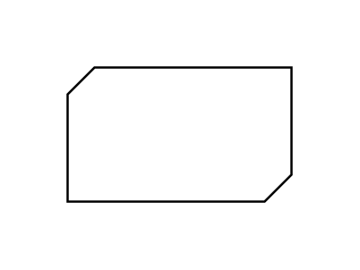

- [DiagonalStripe](./diagonal-stripe.md)  

- [Document](./document.md)  
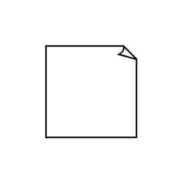

- [Donut](./donut.md)  
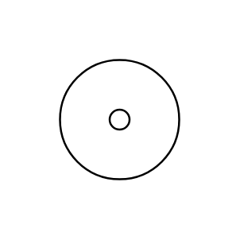

- [Drop](./drop.md)  

- [Flash](./flash.md)  
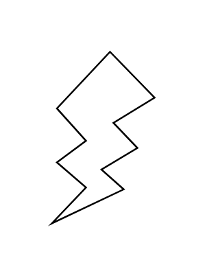

- [Frame](./frame.md)  
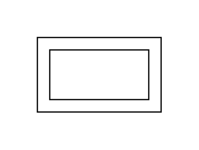

- [FrameCorner](./frame-corner.md)  
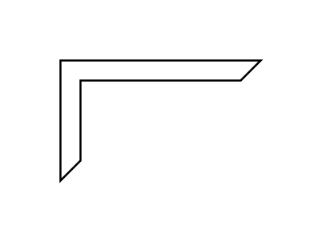

- [HalfCircle](./half-circle.md)  
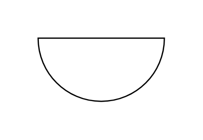

- [Heart](./heart.md)  
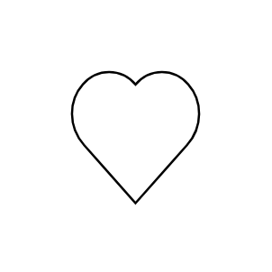

- [IsometricCube](./isometric-cube.md)  
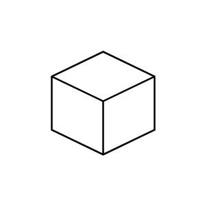

- [LayeredRectangle](./layered-rectangle.md)  

- [LoudCallout](./loud-callout.md)  
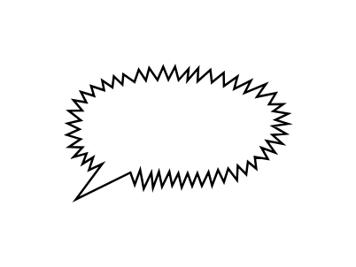

- [Message](./message.md)  

- [Moon](./moon.md)  
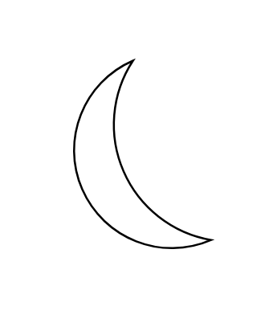

- [NoSymbol](./no-symbol.md)  
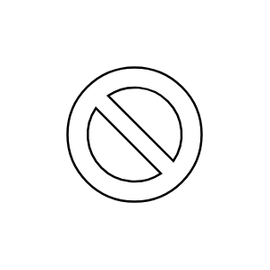

- [ObtuseTriangle](./obtuse-triangle.md)  
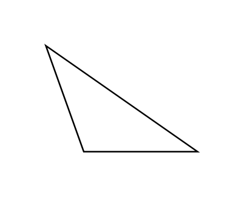

- [Octagon](./octagon.md)  
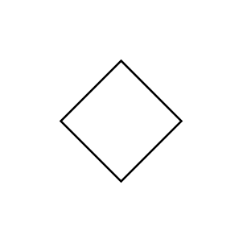

- [OrthogonalTriangle](./orthogonal-triangle.md)  
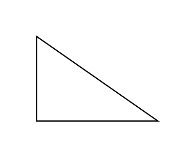

- [OvalCallout](./oval-callout.md)  
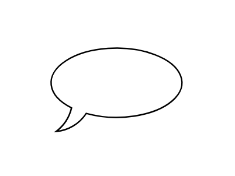

- [PartialConcentricEllipse](./partial-concentric-ellipse.md)  
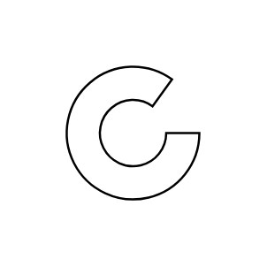

- [PartialRectangle](./partial-rectangle.md)  

- [PartialRectangle2](./partial-rectangle-2.md)  

- [PartialRectangle3](./partial-rectangle-3.md)  

- [PartialRectangle4](./partial-rectangle-4.md)  
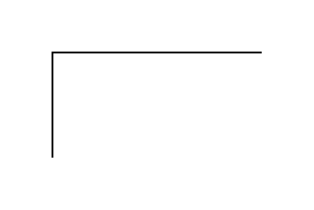

- [PartialRectangle5](./partial-rectangle-5.md)  

- [Pentagon](./pentagon.md)  
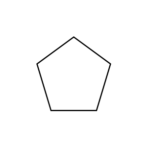

- [Pie](./pie.md)  
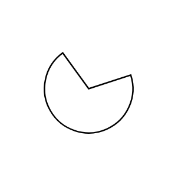

- [Plaque](./plaque.md)  
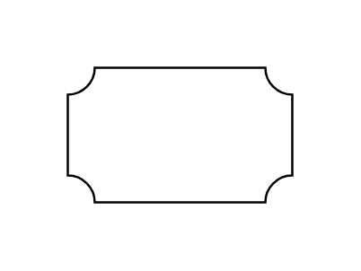

- [PlaqueFrame](./plaque-frame.md)  
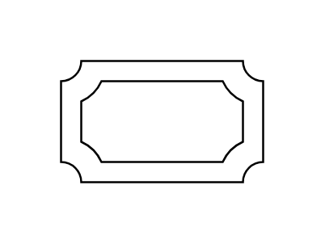

- [PointedOval](./pointed-oval.md)  

- [Polygon](./polygon.md)  

- [Polyline](./polyline.md)  
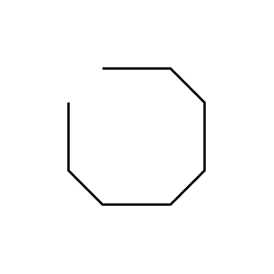

- [Pyramid](./pyramid.md)  
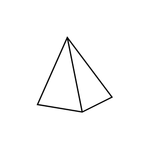

- [RectangleWithDiagonalFill](./rectangle-with-diagonal-fill.md)  

- [RectangleWithDiagonalGridFill](./rectangle-with-diagonal-grid-fill.md)  

- [RectangleWithGridFill](./rectangle-with-grid-fill.md)  
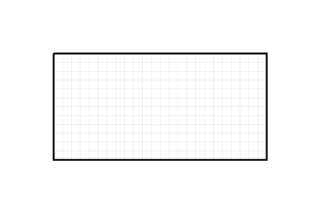

- [RectangleWithHorizontalFill](./rectangle-with-horizontal-fill.md)  
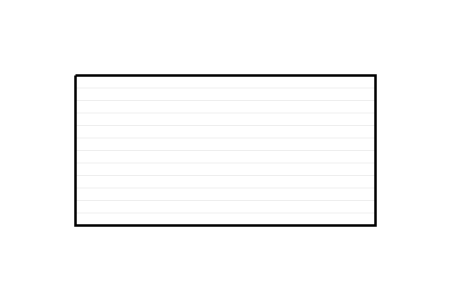

- [RectangleWithReverseDiagonalFill](./rectangle-with-reverse-diagonal-fill.md)  
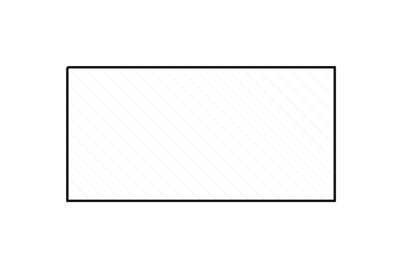

- [RectangleWithVerticalFill](./rectangle-with-vertical-fill.md)  
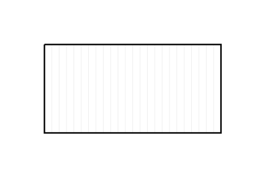

- [RectangularCallout](./rectangular-callout.md)  
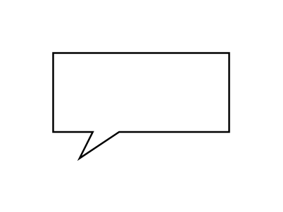

- [RoundedFrame](./rounded-frame.md)  

- [RoundedRectangleThreeCorners](./rounded-rectangle-three-corners.md)  
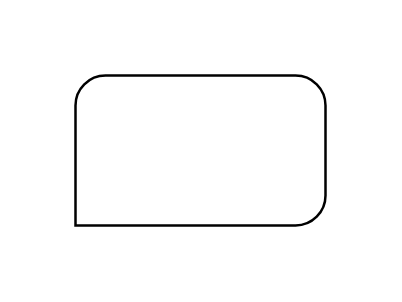

- [RoundedRectangularCallout](./rounded-rectangular-callout.md)  
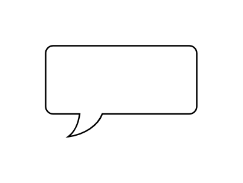

- [Smiley](./smiley.md)  

- [Star](./star.md)  
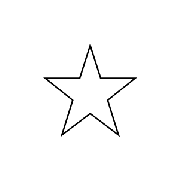

- [Sun](./sun.md)  
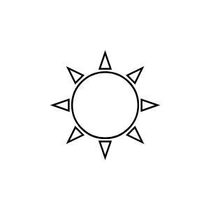

- [Tick](./tick.md)  
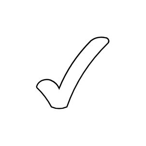

- [Wave](./wave.md)  

- [X](./x.md)  
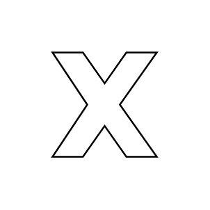
