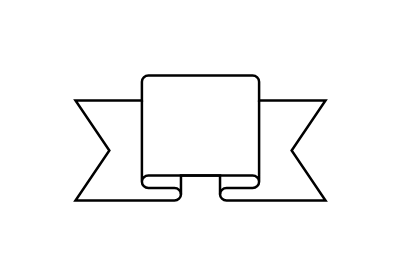

# Banner

## Definition

```js
{
  _style: {
    entity: 'verticalLabelPosition=bottom;verticalAlign=top;html=1;shape=mxgraph.basic.banner',
  },
  _width: 100,
  _height: 50,
}
```

## Usage

```js
import { Banner } from '@dinghy/standard-components-diagrams/basic'

<Banner/>
```

## Preview


