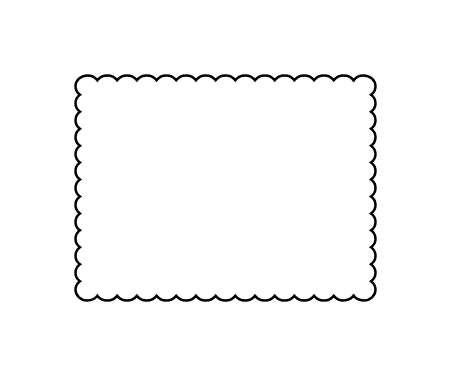

# Cloud Rectangle

## Definition

```js
{
  _style: {
    entity: 'whiteSpace=wrap;html=1;shape=mxgraph.basic.cloud_rect',
  },
  _width: 120,
  _height: 90,
}
```

## Usage

```js
import { CloudRectangle } from '@dinghy/standard-components-diagrams/basic'

<CloudRectangle/>
```

## Preview


