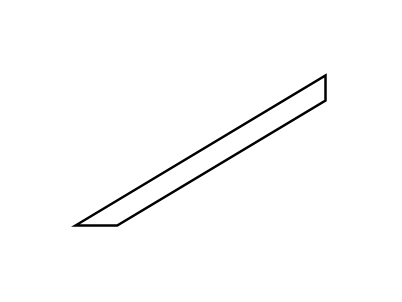

# Diagonal Stripe

## Definition

```js
{
  _style: {
    entity: 'verticalLabelPosition=bottom;verticalAlign=top;html=1;shape=mxgraph.basic.diag_stripe;dx=10;',
  },
  _width: 100,
  _height: 60,
}
```

## Usage

```js
import { DiagonalStripe } from '@dinghy/standard-components-diagrams/basic'

<DiagonalStripe/>
```

## Preview


