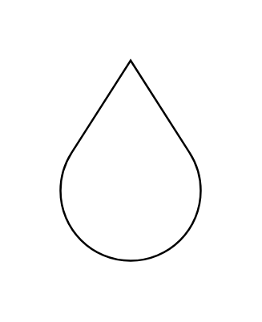

# Drop

## Definition

```js
{
  _style: {
    entity: 'verticalLabelPosition=bottom;verticalAlign=top;html=1;shape=mxgraph.basic.drop',
  },
  _width: 70,
  _height: 100,
}
```

## Usage

```js
import { Drop } from '@dinghy/standard-components-diagrams/basic'

<Drop/>
```

## Preview


