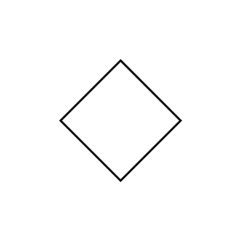

# Octagon

## Definition

```js
{
  _style: {
    entity: 'whiteSpace=wrap;html=1;shape=mxgraph.basic.octagon2;align=center;verticalAlign=middle;dx=15;',
  },
  _original_width: 100,
  _original_height: 100,

}
```

## Usage

```js
import { Octagon } from '@dinghy/standard-components-diagrams/basic'

<Octagon/>
```

## Preview


