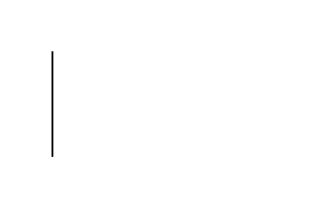

# Partial Rectangle 3

## Definition

```js
{
  _style: {
    entity: 'shape=partialRectangle;whiteSpace=wrap;html=1;right=0;top=0;bottom=0;fillColor=none;routingCenterX=-0.5;',
  },
  _width: 120,
  _height: 60,
}
```

## Usage

```js
import { PartialRectangle3 } from '@dinghy/standard-components-diagrams/basic'

<PartialRectangle3/>
```

## Preview


