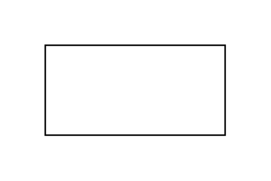

# Partial Rectangle

## Definition

```js
{
  _style: {
    entity: 'verticalLabelPosition=bottom;verticalAlign=top;html=1;shape=mxgraph.basic.rect;fillColor2=none;strokeWidth=1;size=20;indent=5;',
  },
  _width: 120,
  _height: 60,
}
```

## Usage

```js
import { PartialRectangle } from '@dinghy/standard-components-diagrams/basic'

<PartialRectangle/>
```

## Preview


