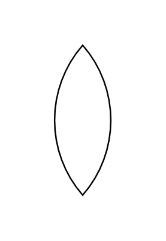

# Pointed Oval

## Definition

```js
{
  _style: {
    entity: 'whiteSpace=wrap;html=1;shape=mxgraph.basic.pointed_oval',
  },
  _width: 50,
  _height: 100,
}
```

## Usage

```js
import { PointedOval } from '@dinghy/standard-components-diagrams/basic'

<PointedOval/>
```

## Preview


