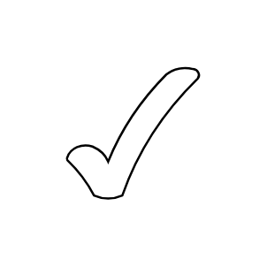

# Tick

## Definition

```js
{
  _style: {
    entity: 'verticalLabelPosition=bottom;verticalAlign=top;html=1;shape=mxgraph.basic.tick',
  },
  _original_width: 85,
  _original_height: 100,

}
```

## Usage

```js
import { Tick } from '@dinghy/standard-components-diagrams/basic'

<Tick/>
```

## Preview


