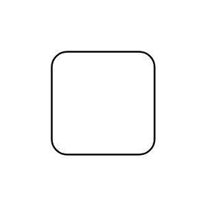

# Palm Treo

## Definition

```js
{
  _style: {
    entity: 'image;html=1;image=img/lib/clip_art/telecommunication/Palm_Treo_128x128.pngstrokeColor=none;',
  },
  _original_width: 80,
  _original_height: 80,

}
```

## Usage

```js
import { PalmTreo } from '@dinghy/standard-components-diagrams/clipartTelecommunication'

<PalmTreo/>
```

## Preview


