# Standard Flowchart Entities

- [Annotation](./annotation.md)  
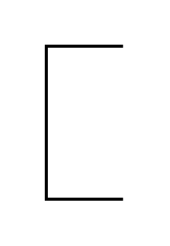

- [Annotation2](./annotation-2.md)  
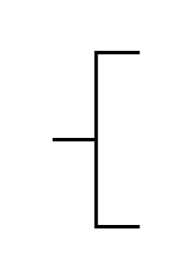

- [Card](./card.md)  
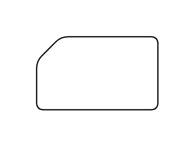

- [Collate](./collate.md)  
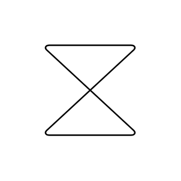

- [Data](./data.md)  
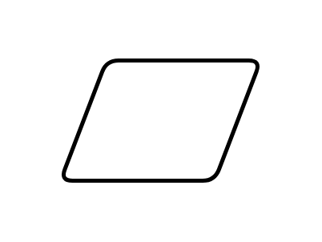

- [Database](./database.md)  
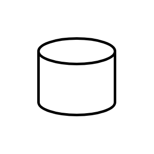

- [Decision](./decision.md)  
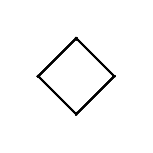

- [Delay](./delay.md)  

- [DirectData](./direct-data.md)  
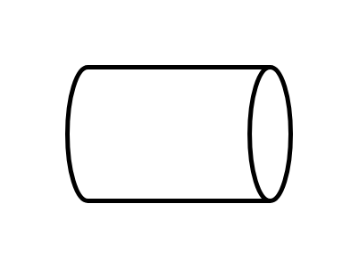

- [Display](./display.md)  
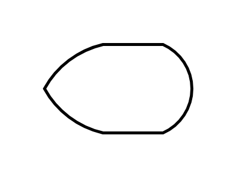

- [Document](./document.md)  

- [ExtractOrMeasurement](./extract-or-measurement.md)  
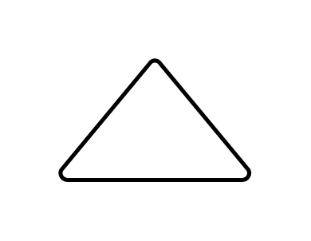

- [InternalStorage](./internal-storage.md)  
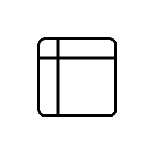

- [LoopLimit](./loop-limit.md)  
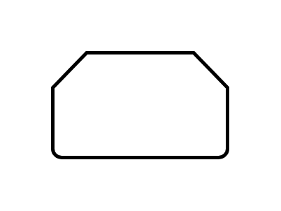

- [ManualInput](./manual-input.md)  
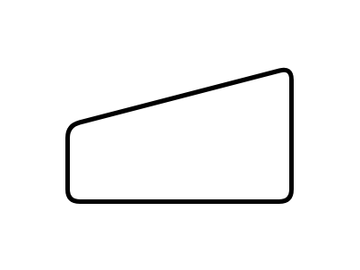

- [ManualOperation](./manual-operation.md)  
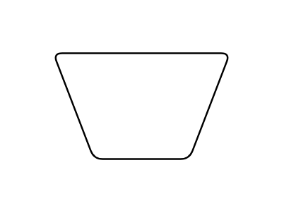

- [MergeOrStorage](./merge-or-storage.md)  
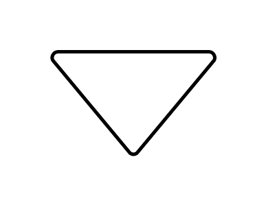

- [MultiDocument](./multi-document.md)  
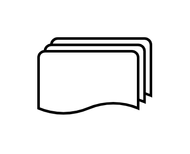

- [OffPageReference](./off-page-reference.md)  
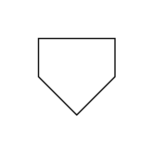

- [OnPageReference](./on-page-reference.md)  

- [Or](./or.md)  
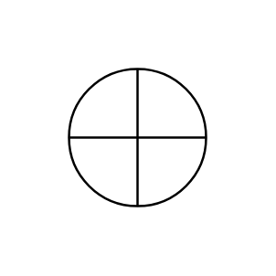

- [ParallelMode](./parallel-mode.md)  
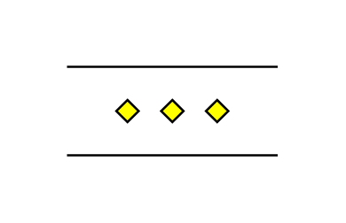

- [PredefinedProcess](./predefined-process.md)  
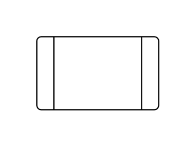

- [Preparation](./preparation.md)  

- [Process](./process.md)  
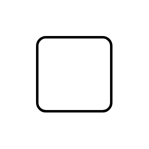

- [SequentialData](./sequential-data.md)  
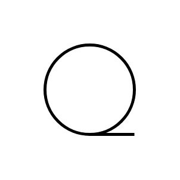

- [Sort](./sort.md)  
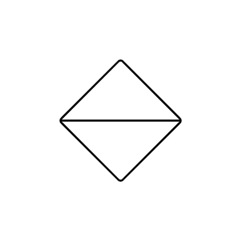

- [Start](./start.md)  
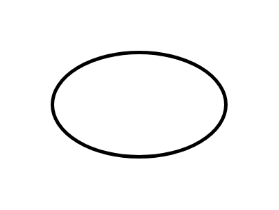

- [Start2](./start-2.md)  
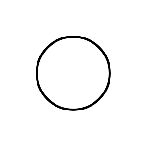

- [StoredData](./stored-data.md)  
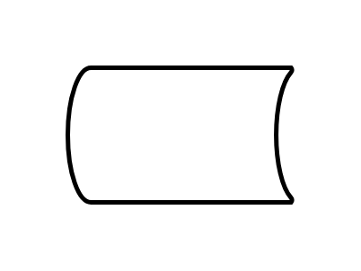

- [SummingJunction](./summing-junction.md)  
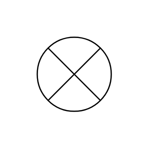

- [Tape](./tape.md)  
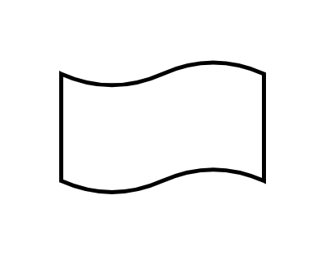

- [Terminator](./terminator.md)  
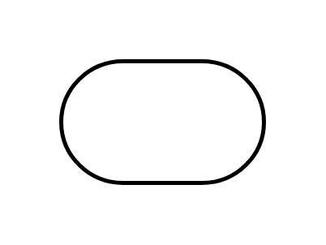

- [Transfer](./transfer.md)  

