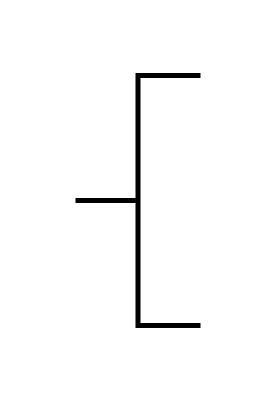

# Annotation 2

## Definition

```js
{
  _style: {
    entity: 'strokeWidth=2;html=1;shape=mxgraph.flowchart.annotation_2;align=left;labelPosition=right;pointerEvents=1;',
  },
  _width: 50,
  _height: 100,
}
```

## Usage

```js
import { Annotation2 } from '@dinghy/standard-components-diagrams/flowchart'

<Annotation2/>
```

## Preview


