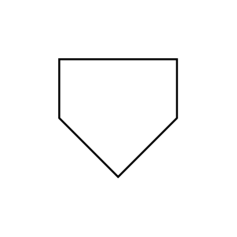

# Off-Page Reference

## Definition

```js
{
  _style: {
    entity: 'verticalLabelPosition=bottom;verticalAlign=top;html=1;shape=offPageConnector;rounded=0;size=0.5;',
  },
  _original_width: 60,
  _original_height: 60,

}
```

## Usage

```js
import { OffPageReference } from '@dinghy/standard-components-diagrams/flowchart'

<OffPageReference/>
```

## Preview


