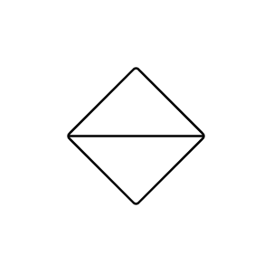

# Sort

## Definition

```js
{
  _style: {
    entity: 'verticalLabelPosition=bottom;verticalAlign=top;html=1;shape=mxgraph.flowchart.sort;',
  },
  _original_width: 100,
  _original_height: 100,

}
```

## Usage

```js
import { Sort } from '@dinghy/standard-components-diagrams/flowchart'

<Sort/>
```

## Preview


