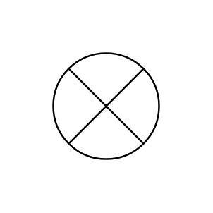

# Summing Junction

## Definition

```js
{
  _style: {
    entity: 'verticalLabelPosition=bottom;verticalAlign=top;html=1;shape=mxgraph.flowchart.or;',
  },
  _original_width: 70,
  _original_height: 70,

}
```

## Usage

```js
import { SummingJunction } from '@dinghy/standard-components-diagrams/flowchart'

<SummingJunction/>
```

## Preview


