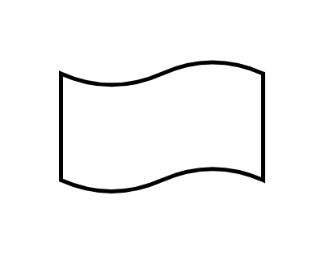

# Tape

## Definition

```js
{
  _style: {
    entity: 'shape=tape;whiteSpace=wrap;html=1;strokeWidth=2;size=0.19',
  },
  _width: 100,
  _height: 65,
}
```

## Usage

```js
import { Tape } from '@dinghy/standard-components-diagrams/flowchart'

<Tape/>
```

## Preview


