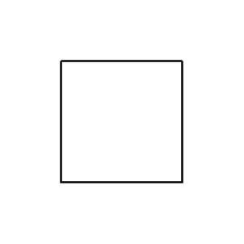

# Container

## Definition

```js
{
  _style: {
    entity: 'swimlane;startSize=0;',
  },
  _original_width: 200,
  _original_height: 200,

}
```

## Usage

```js
import { Container } from '@dinghy/standard-components-diagrams/general'

<Container/>
```

## Preview


