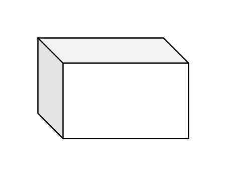

# Cube

## Definition

```js
{
  _style: {
    entity: 'shape=cube;whiteSpace=wrap;html=1;boundedLbl=1;backgroundOutline=1;darkOpacity=0.05;darkOpacity2=0.1;',
  },
  _width: 120,
  _height: 80,
}
```

## Usage

```js
import { Cube } from '@dinghy/standard-components-diagrams/general'

<Cube/>
```

## Preview


