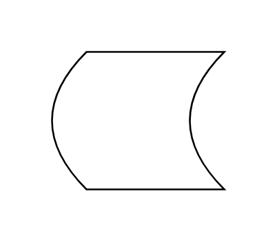

# Data Storage

## Definition

```js
{
  _style: {
    entity: 'shape=dataStorage;whiteSpace=wrap;html=1;fixedSize=1;',
  },
  _width: 100,
  _height: 80,
}
```

## Usage

```js
import { DataStorage } from '@dinghy/standard-components-diagrams/general'

<DataStorage/>
```

## Preview


