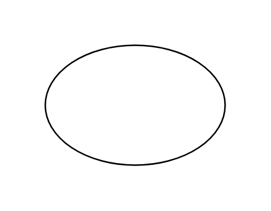

# Ellipse

## Definition

```js
{
  _style: {
    entity: 'ellipse;whiteSpace=wrap;html=1;',
  },
  _width: 120,
  _height: 80,
}
```

## Usage

```js
import { Ellipse } from '@dinghy/standard-components-diagrams/general'

<Ellipse/>
```

## Preview


