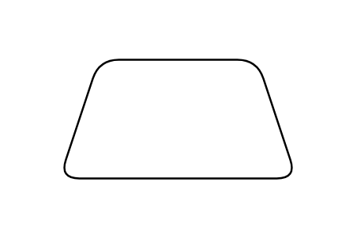

# Trapezoid

## Definition

```js
{
  _style: {
    entity: 'shape=trapezoid;perimeter=trapezoidPerimeter;whiteSpace=wrap;html=1;fixedSize=1;',
  },
  _width: 120,
  _height: 60,
}
```

## Usage

```js
import { Trapezoid } from '@dinghy/standard-components-diagrams/general'

<Trapezoid/>
```

## Preview


