# Standard Misc Entities

- [CrossFunctionalFlowchart](./cross-functional-flowchart.md)  

- [DiamondSketch](./diamond-sketch.md)  
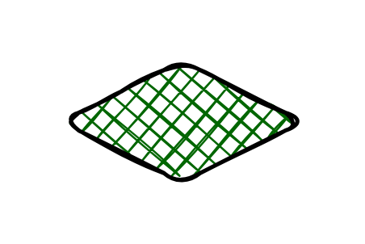

- [DoubleCircle](./double-circle.md)  
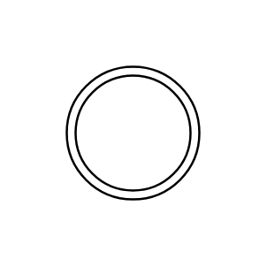

- [DoubleEllipse](./double-ellipse.md)  
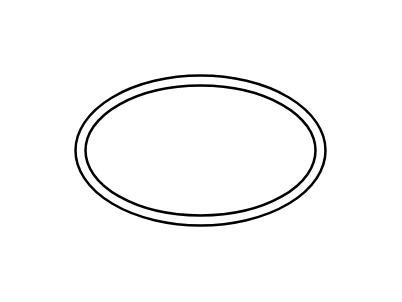

- [DoubleRectangle](./double-rectangle.md)  
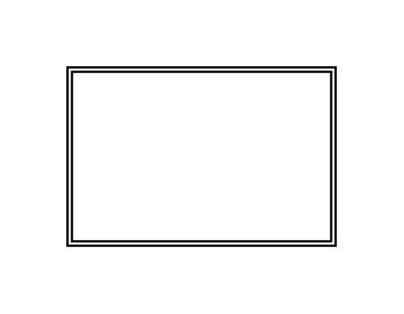

- [DoubleRoundedRectangle](./double-rounded-rectangle.md)  

- [DoubleSquare](./double-square.md)  
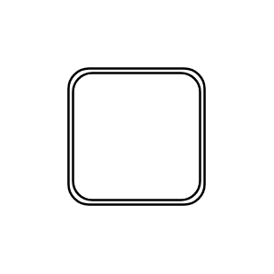

- [EllipseSketch](./ellipse-sketch.md)  
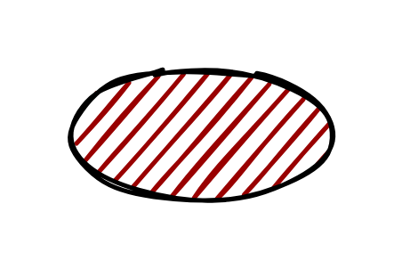

- [HorizontalBackbone](./horizontal-backbone.md)  
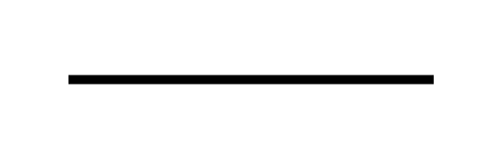

- [HorizontalCrossbar](./horizontal-crossbar.md)  
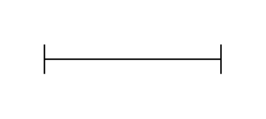

- [HorizontalLine](./horizontal-line.md)  

- [HtmlTable4](./html-table-4.md)  

- [Icon](./icon.md)  

- [ImageFixedAspect](./image-fixed-aspect.md)  

- [ImageVariableAspect](./image-variable-aspect.md)  

- [IsometricCube](./isometric-cube.md)  

- [IsometricSquare](./isometric-square.md)  
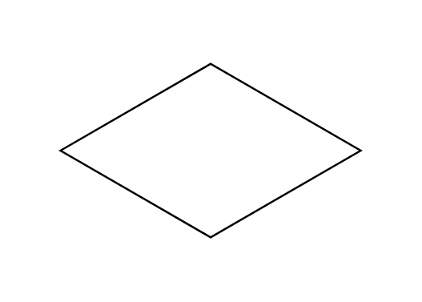

- [Label1](./label-1.md)  
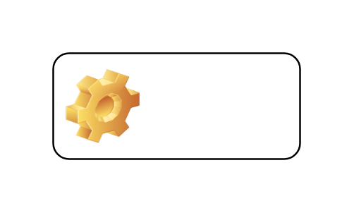

- [Label2](./label-2.md)  

- [LeftCurlyBracket](./left-curly-bracket.md)  

- [Note](./note.md)  

- [PartialRectangle](./partial-rectangle.md)  

- [PartialRectangle2](./partial-rectangle-2.md)  

- [PartialRectangle3](./partial-rectangle-3.md)  

- [PartialRectangle4](./partial-rectangle-4.md)  
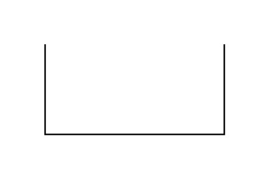

- [RectangleSketch](./rectangle-sketch.md)  
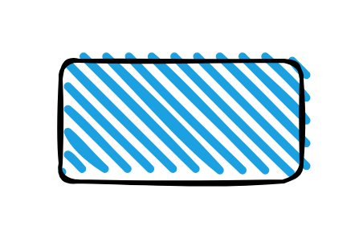

- [RightCurlyBracket](./right-curly-bracket.md)  
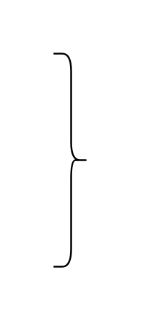

- [Table](./table.md)  

- [Table3](./table-3.md)  

- [Table4](./table-4.md)  

- [Timestamp](./timestamp.md)  

- [Title](./title.md)  

- [UnorderedList](./unordered-list.md)  

- [VerticalBackbone](./vertical-backbone.md)  

- [VerticalCrossbar](./vertical-crossbar.md)  
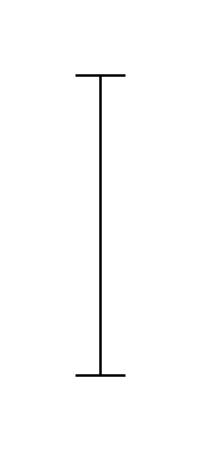

- [VerticalLine](./vertical-line.md)  

- [VerticalList2](./vertical-list-2.md)  

- [Waypoint](./waypoint.md)  
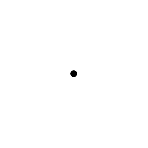
