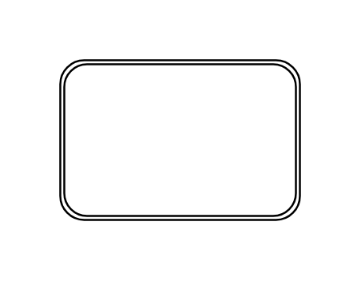

# Double Rounded Rectangle

## Definition

```js
{
  _style: {
    entity: 'shape=ext;double=1;rounded=1;whiteSpace=wrap;html=1;',
  },
  _width: 120,
  _height: 80,
}
```

## Usage

```js
import { DoubleRoundedRectangle } from '@dinghy/standard-components-diagrams/misc'

<DoubleRoundedRectangle/>
```

## Preview


