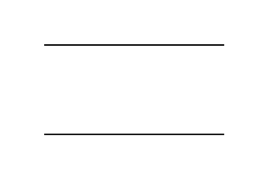

# Partial Rectangle

## Definition

```js
{
  _style: {
    entity: 'shape=partialRectangle;whiteSpace=wrap;html=1;left=0;right=0;fillColor=none;',
  },
  _width: 120,
  _height: 60,
}
```

## Usage

```js
import { PartialRectangle } from '@dinghy/standard-components-diagrams/misc'

<PartialRectangle/>
```

## Preview


