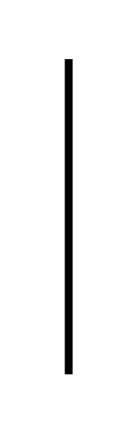

# Vertical Backbone

## Definition

```js
{
  _style: {
    entity: 'line;strokeWidth=4;direction=south;html=1;perimeter=backbonePerimeter;points=[];outlineConnect=0;',
  },
  _width: 10,
  _height: 160,
}
```

## Usage

```js
import { VerticalBackbone } from '@dinghy/standard-components-diagrams/misc'

<VerticalBackbone/>
```

## Preview


