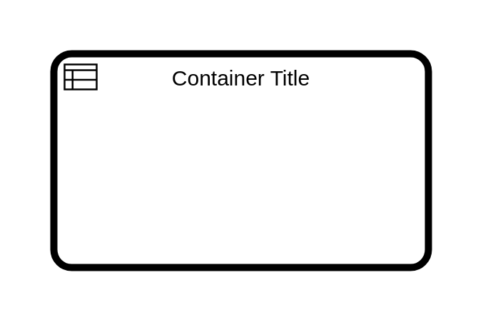

# Business Rule Call Activity

## Definition

```js
{
  _style: {
    container: 'points=[[0.25,0,0],[0.5,0,0],[0.75,0,0],[1,0.25,0],[1,0.5,0],[1,0.75,0],[0.75,1,0],[0.5,1,0],[0.25,1,0],[0,0.75,0],[0,0.5,0],[0,0.25,0]];shape=mxgraph.bpmn.task2;whiteSpace=wrap;rectStyle=rounded;size=10;html=1;container=1;expand=0;collapsible=0;bpmnShapeType=call;taskMarker=businessRule;',
    },
}
```

## Usage

```js
import { BusinessRuleCallActivity } from '@dinghy/standard-components-diagrams/bpmn2Tasks'

<BusinessRuleCallActivity/>
```

## Preview


