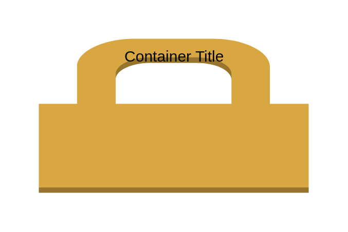

# VPC Subnet

## Definition

```js
{
  _style: {
    container: 'dashed=0;html=1;shape=mxgraph.aws3.permissions;fillColor=#D9A741;gradientColor=none;dashed=0;',
    entity:{
      fillColor:'#D9A741',},
    },
}
```

## Usage

```js
import { VpcSubnet } from '@dinghy/standard-components-diagrams/aws17Groups'

<VpcSubnet/>
```

## Preview


