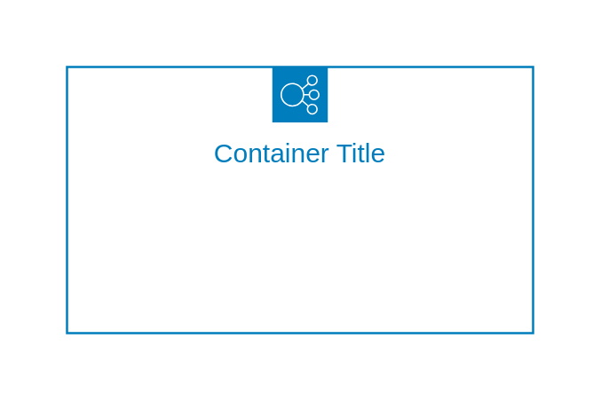

# Elastic Load Balancing

## Definition

```js
{
  _style: {
    container: 'sketch=0;outlineConnect=0;gradientColor=none;html=1;whiteSpace=wrap;fontSize=12;fontStyle=0;shape=mxgraph.aws4.groupCenter;grIcon=mxgraph.aws4.group_elastic_load_balancing;grStroke=1;strokeColor=#007DBC;fillColor=none;verticalAlign=top;align=center;fontColor=#007DBC;dashed=0;spacingTop=25;',
    entity:{
      strokeColor:'#007DBC',fontColor:'#007DBC',},
    },
}
```

## Usage

```js
import { ElasticLoadBalancing } from '@dinghy/standard-components-diagrams/aws18GroupsLight'

<ElasticLoadBalancing/>
```

## Preview


