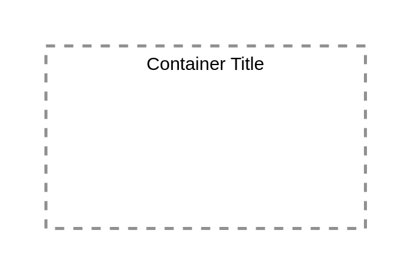

# Resource Group

## Definition

```js
{
  _style: {
    container: 'fontStyle=0;verticalAlign=top;align=center;spacingTop=-2;fillColor=none;rounded=0;whiteSpace=wrap;html=1;strokeColor=#919191;strokeWidth=2;dashed=1;container=1;collapsible=0;expand=0;recursiveResize=0;',
    entity:{
      strokeColor:'#919191',},
    },
}
```

## Usage

```js
import { ResourceGroup } from '@dinghy/standard-components-diagrams/ibmBoxes'

<ResourceGroup/>
```

## Preview


