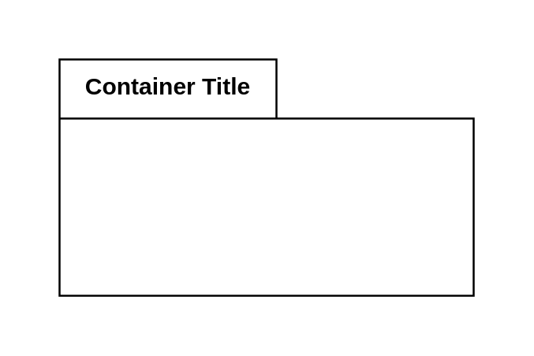

# Package 2

## Definition

```js
{
  _style: {
    container: 'shape=folder;fontStyle=1;tabWidth=110;tabHeight=30;tabPosition=left;html=1;boundedLbl=1;labelInHeader=1;container=1;collapsible=0;recursiveResize=0;whiteSpace=wrap;',
    },
}
```

## Usage

```js
import { Package2 } from '@dinghy/standard-components-diagrams/uml25'

<Package2/>
```

## Preview


