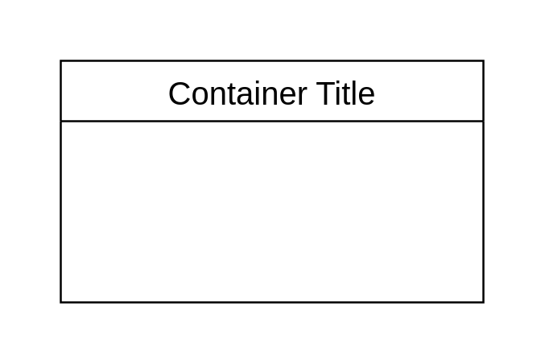

# Table with Title 2

## Definition

```js
{
  _style: {
    container: 'shape=table;startSize=30;container=1;collapsible=0;childLayout=tableLayout;fixedRows=1;rowLines=0;fontStyle=0;strokeColor=default;fontSize=16;',
    },
}
```

## Usage

```js
import { TableWithTitle2 } from '@dinghy/standard-components-diagrams/misc'

<TableWithTitle2/>
```

## Preview


