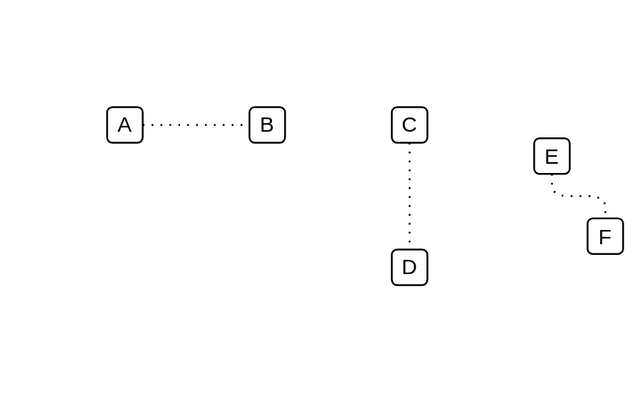
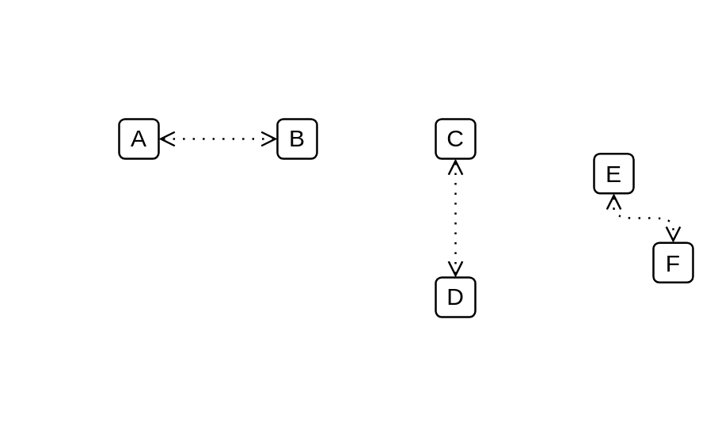
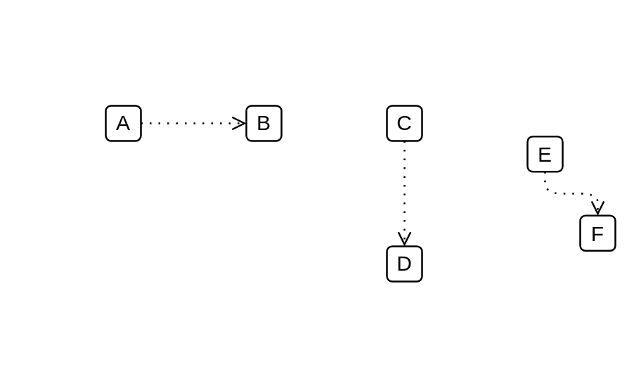
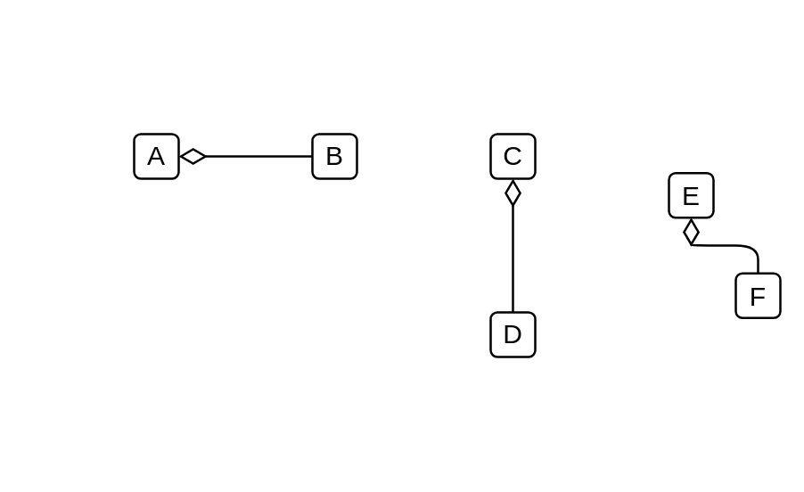
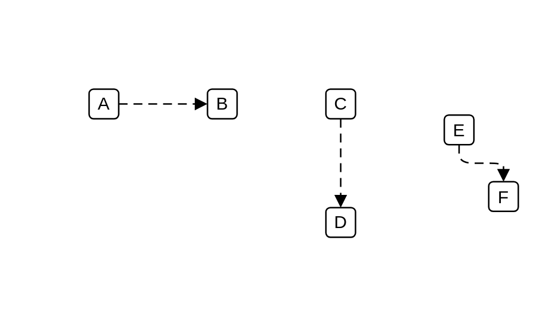

# Archimate3 Relationships Dependencies

- [Access](./access.md)  

- [Access2](./access-2.md)  

- [Access3](./access-3.md)  

- [Aggregation](./aggregation.md)  

- [Assignment](./assignment.md)  

- [Association](./association.md)  

- [Association2](./association-2.md)  

- [Composition](./composition.md)  

- [Flow](./flow.md)  

- [Realization](./realization.md)  

- [Serving](./serving.md)  

- [Specialization](./specialization.md)  

- [Triggering](./triggering.md)  

