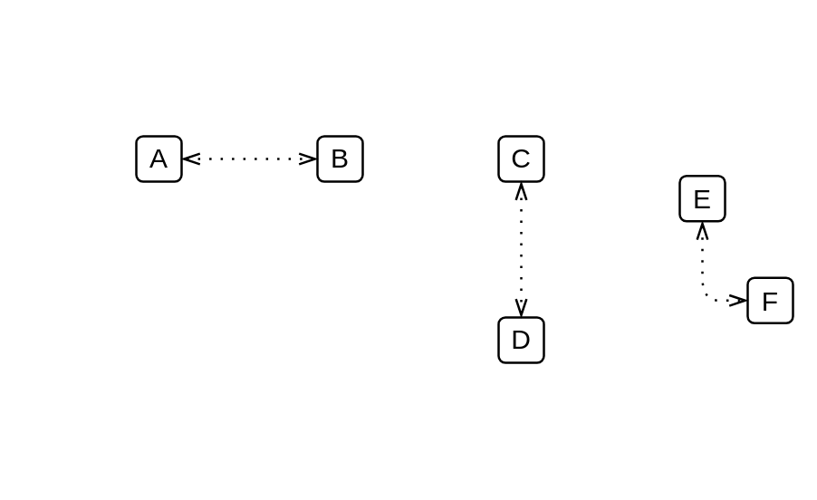

# Bi-Directional Association

## Definition

```js
{
  _style: {
    dependency: 'edgeStyle=elbowEdgeStyle;fontSize=12;html=1;endFill=0;startFill=0;endSize=6;startSize=6;dashed=1;dashPattern=1 4;endArrow=openThin;startArrow=openThin;',
  },
}
```

## Usage

```js
import { BiDirectionalAssociation } from '@dinghy/standard-components-diagrams/bpmn2General'

<BiDirectionalAssociation/>
```

## Preview


