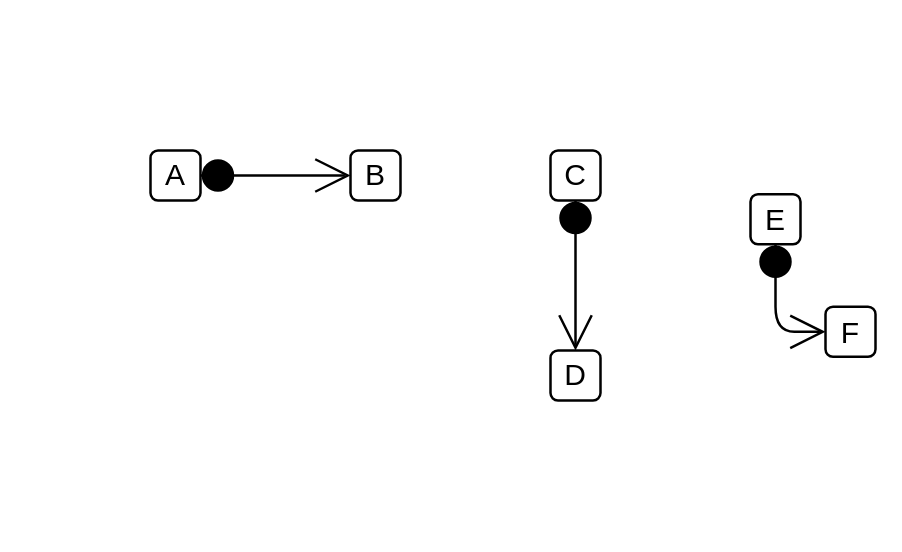

# Found Message

## Definition

```js
{
  _style: {
    dependency: 'edgeStyle=none;html=1;endArrow=open;endSize=12;verticalAlign=bottom;startArrow=sysMLFound;startSize=12;',
  },
}
```

## Usage

```js
import { FoundMessage } from '@dinghy/standard-components-diagrams/sysmlInteractions'

<FoundMessage/>
```

## Preview


