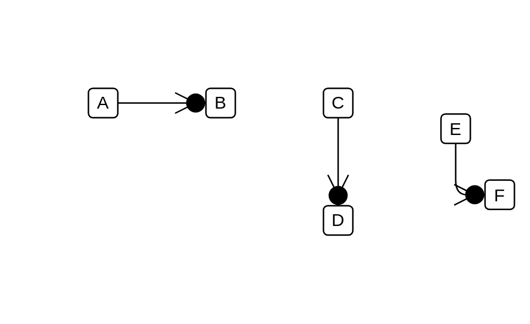

# Lost Message

## Definition

```js
{
  _style: {
    dependency: 'edgeStyle=none;html=1;endArrow=sysMLLost;endSize=12;verticalAlign=bottom;',
  },
}
```

## Usage

```js
import { LostMessage } from '@dinghy/standard-components-diagrams/sysmlInteractions'

<LostMessage/>
```

## Preview


