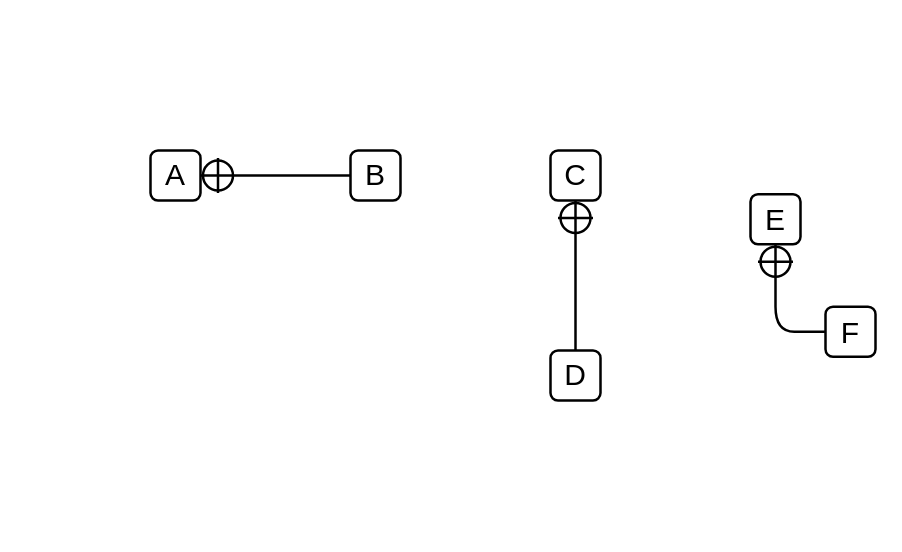

# Package Containment

## Definition

```js
{
  _style: {
    dependency: 'edgeStyle=none;html=1;startArrow=sysMLPackCont;startSize=12;endArrow=none;',
  },
}
```

## Usage

```js
import { PackageContainment } from '@dinghy/standard-components-diagrams/sysmlModelElements'

<PackageContainment/>
```

## Preview


