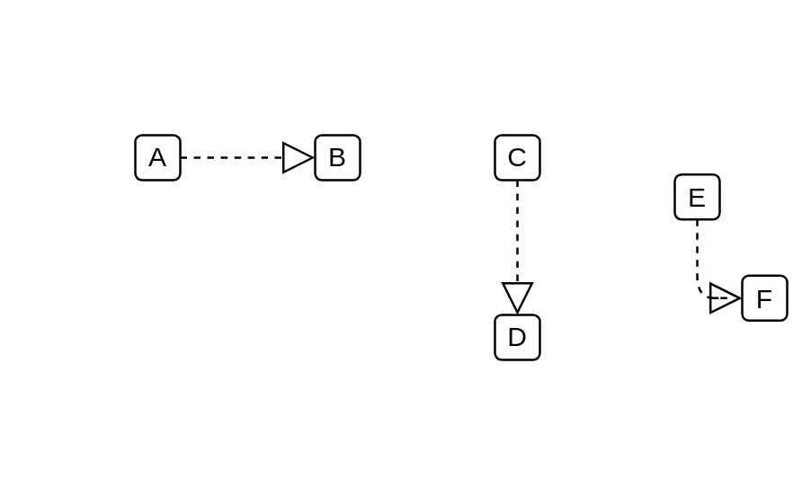

# Realization

## Definition

```js
{
  _style: {
    dependency: 'edgeStyle=none;html=1;endSize=12;endArrow=block;endFill=0;dashed=1;',
  },
}
```

## Usage

```js
import { Realization } from '@dinghy/standard-components-diagrams/sysmlModelElements'

<Realization/>
```

## Preview


