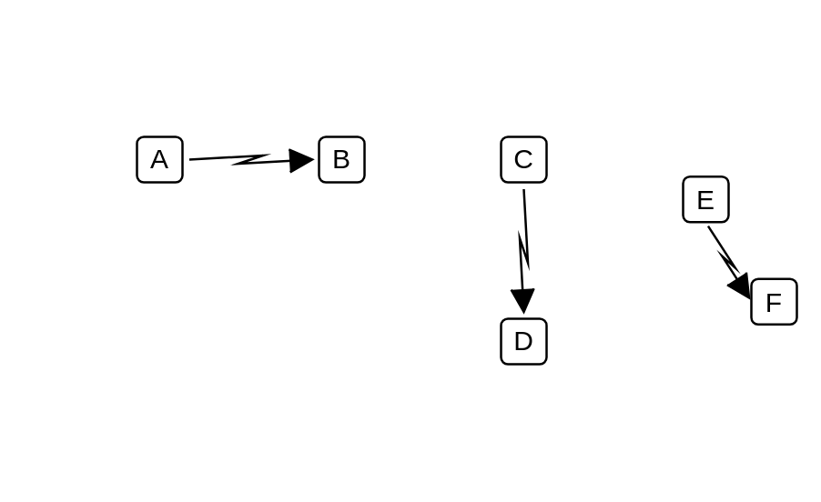

# Electronic Information

## Definition

```js
{
  _style: {
    dependency: 'shape=mxgraph.lean_mapping.electronic_info_flow_edge;html=1;',
  },
}
```

## Usage

```js
import { ElectronicInformation } from '@dinghy/standard-components-diagrams/valueStreamMapping'

<ElectronicInformation/>
```

## Preview


